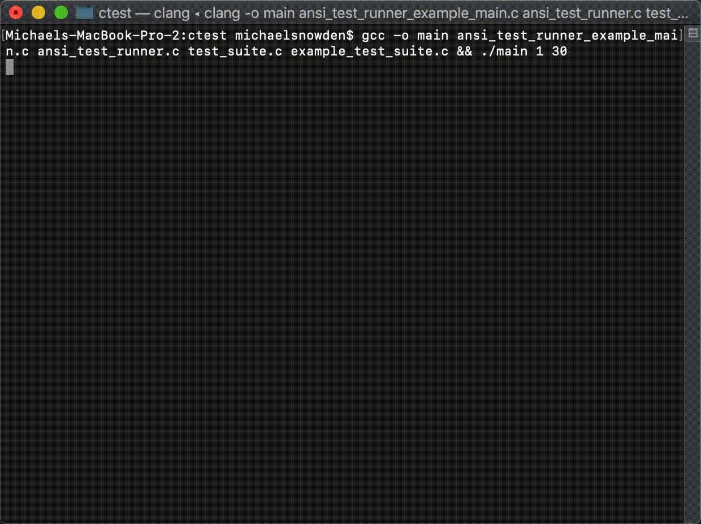

# C Test Runner
This repo contains a tool for writing and running tests in C.

## Testing this project

```shell script
make test
```

It's worth checking out the test logs directory, especially `stackTrace.txt` because it shows an 
example stack trace from the `printStackTrace` function this repo provides.

## Including in your project

Add this to your `CMakeLists.txt`:

```cmake
# clone and install the repo
# alternatively, you can just clone and run `make install` once
include(ExternalProject)
ExternalProject_Add(
        testc
        GIT_REPOSITORY git@github.com:MichaelSnowden/TestC.git
        GIT_TAG master
)

# add the <testc/*> headers and link the *.a libraries
include_directories(/usr/local/include/testc)
link_directories(/usr/local/lib/testc)

# an example test
add_library(http_parser_test http_parser_test.c)
target_link_libraries(http_parser_test test_suite)

# the one and only executable which will run all tests
# this target should depend on the testc project so that it installs
add_executable(test test.c)
add_dependencies(test testc)

# link the test_runner and test_suite targets to your test entrypoint
# also, link any tests your project has
target_link_libraries(test test_suite)
target_link_libraries(test test_runner)
target_link_libraries(test http_parser_test)
```

This will add a step to download this repo and install it globally.

## Examples and configuration

See the directory `test` for an example of how to include and use this library. The right way is to
specify one  executable per project. This executable should then include every other test in the 
project as a library.

See documentation for the command line options in `TestC_main` or by running:

```shell script
make help
```

To see the test runner in action (and to also test this repo), run:

```shell script
make test
```



Test logs are generated for each run by default, but they are not included if 
`--nofork` is specified.


## Defining test suites

It's easiest to define tests as a single C file with no header e.g.

```c
// http_parser_test.c
#include <testc/test_suite.h>

TEST(parseGoodRequest) {
    ASSERT_EQ(parse(goodRequest), 0);
}

TEST(parseBadRequest) {
    ASSERT_EQ(parse(badRequest), 1);
}

SUITE(httpParser, &parseGoodRequest, &parseBadRequest)
```

```cmake
# CMakeLists.txt
add_library(http_parser_test http_parser_test.c)
target_link_libraries(http_parser_test test_suite)
```

..and then directly include that test file, suppressing warnings

```c
// test.c
#pragma clang diagnostic push
#pragma ide diagnostic ignored "bugprone-suspicious-include"
#include "http_parser_test.c"
#pragma clang diagnostic pop
#include <testc/test_runner.h>

SUITE(all, &httpParser)

int main(int argc, char **argv) {
    return TestC_main(&all, argc, argv);
}
```

```cmake
# CMakeLists.txt
add_executable(test test.c)
target_link_libraries(test test_runner)
target_link_libraries(test http_parser_test)
```

## Debugging

To debug a test, debug the main file with `--nofork` and specify `--filter` to be `path.to.test`; e.g. 
`all.httpParser.parseGoodRequest`.

## Implementation details

A test is just a void function, so it either returns, runs forever, or eventually causes a signal 
that the parent  process can check. We consider a test to pass iff it returns or if it exits with an
exit status of zero (`WIFEXITED(signal) && WEXITSTATUS(signal) == 0`). Since test failures can cause
their process to exit, we need to sandbox them. This library sandboxes tests by running them in a 
child process using `fork`. The calling process then waits for the child process and determines 
whether it was a pass or a fail by checking the resulting signal from `wait`. Since the test runs in 
a child process, it also makes it easy to silence any logs it outputs to stdout using `dup2`,and 
it's also easy to delay the processing of its stderr logs. We don't want to just let the test output 
to the stderr of the parent process because we want the result of the test to appear before it in the 
logs, and we also want to format its output by indenting it properly.
