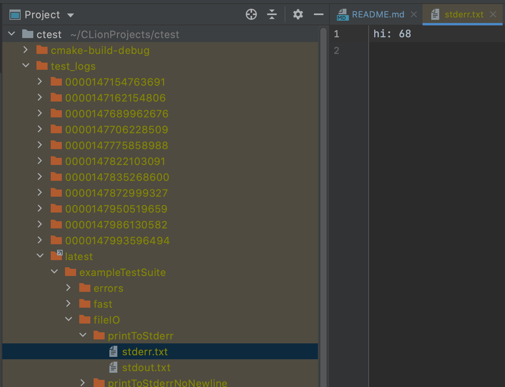

# C Test Runner
This repo contains a tool for writing and running tests in C.

## Testing this project

```sh
make test
```

## Including in your own project

Add this to your `CMakeLists.txt`:

```cmake
# clone and install the repo
# alternatively, you can just clone and run `make install` once
include(ExternalProject)
ExternalProject_Add(
        testc
        GIT_REPOSITORY git@github.com:MichaelSnowden/TestC.git
        GIT_TAG master
)

# add the <testc/*> headers and link the *.a libraries
include_directories(/usr/local/include/testc)
link_directories(/usr/local/lib/testc)

# an example test
add_library(http_parser_test http_parser_test.c)
target_link_libraries(http_parser_test test_suite)

# the one and only executable which will run all tests
# this target should depend on the testc project so that it installs
add_executable(test test.c)
add_dependencies(test testc)

# link the test_runner and test_suite targets to your test entrypoint
# also, link any tests your project has
target_link_libraries(test test_suite)
target_link_libraries(test test_runner)
target_link_libraries(test http_parser_test)
```

This will add a step to download this repo and install it globally.

## Examples and configuration

See the directory `test` for an example of how to include and use this library. The right way to use this library is to specify one executable per project. This executable should then include every other test in the project as a library.

See documentation for the command line options in `TestC_main` or by running

```sh
make help
```


Test logs are generated for each run by default, but they are not included if `--nofork` is specified.




## Debugging

To debug a failed test, debug the main file with `--nofork` and specify `--filter` to be `path.to.test`.


## Defining test suites

Usually, a test isn't standalone, but is part of a suite of tests, which together form a rooted acyclic graph, which
is almost always a tree, but it doesn't have to be. So, essentially the nodes in that tree are `TestSuite` structs.
These structs employ a simple tag and `union` pattern to store their data depending on whether they are leaf nodes or
not. All nodes have a name, but only leaf nodes have a test method. Non-leaf nodes have a list of children. 

When writing C code, I prefer to never use macros, but, if they can simplify code a lot, I do use them as a last resort.
In this case, I've wrote 2 macros: `TEST` and `SUITE`, which save a lot of time. Here's an example before and after
macros, and I think by looking at it, you'll see that there is almost no way to do this without macros.

Without using macros

```c
void testFooBarMethod() {
    assert(Foo_bar() == expectedFooBar);
}

const TestSuite testFooBar = {
        .name = "testFooBar",
        .isLeaf = 1,
        .test = testFooBarMethod,
};

const TestSuite *testFooSuites[] = {&testFooBar};

const TestSuite testFoo = {
        .name = "testFoo",
        .isLeaf = 0,
        .suites = testFooSuites,
        .numChildren = sizeof(testFooSuites) / sizeof(TestSuite *)
};
``` 

After using macros

```c
TEST(testFooBar) {
    assert(Foo_bar() == expectedFooBar);
}

SUITE(testFoo, &testFooBar)
```

There are a couple things that macros help with here:
- C doesn't support introspection, so the name has to be stored, and macros can write the test name for us to keep it in line with both the TestSuite for the method and the method name itself.
- C doesn't support inline method definitions. For example, I can't write `(TestSuite) { .test = (int)() { return 0 ; } }`. There are non-standard ways to write this using blocks or lambdas, though.

## Implementation details

A test is just a void function, so it either returns or signals. We consider a test to pass iff it returns or if it exits with an exit
status of zero (`WIFEXITED(signal) && WEXITSTATUS(signal) == 0`). Since test failures can cause their process to exit, we need to sandbox them. This library sandboxes tests by running them in a separate process using `fork`. The calling process then waits for the child process 
and determines whether it was a pass or a fail by checking the resulting signal `wait`. Since the test runs in a child
process, it also makes it easy to silence any logs it outputs to stdout using `dup2`, and it's also easy to delay the
processing of its stderr logs. We don't want to just let the test output to the stderr of the parent process because
we want the result of the test to appear before it in the logs, and we also want to format its output by indenting it
properly.
